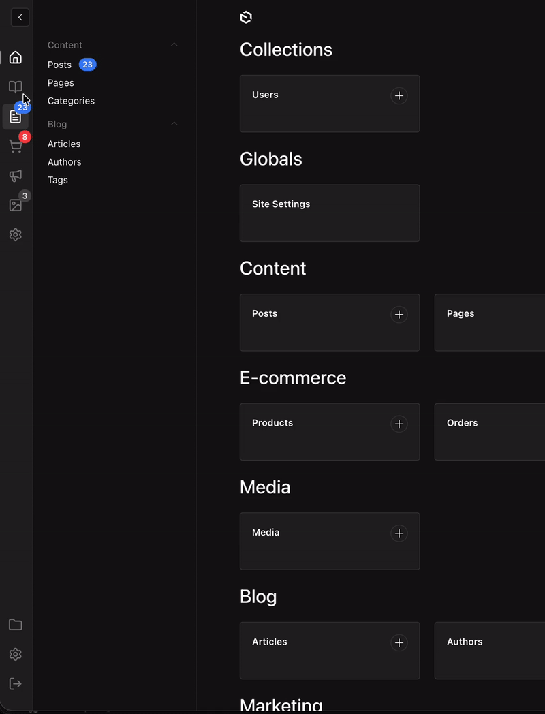
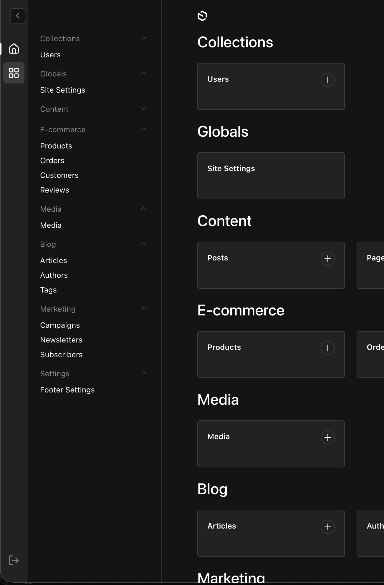
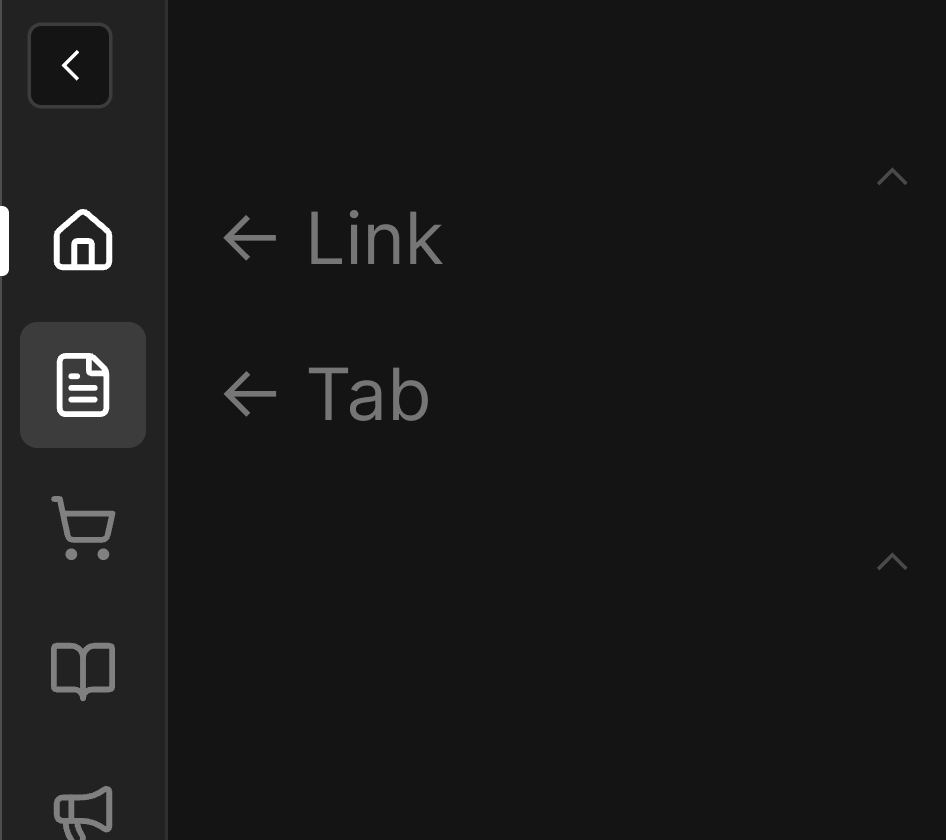
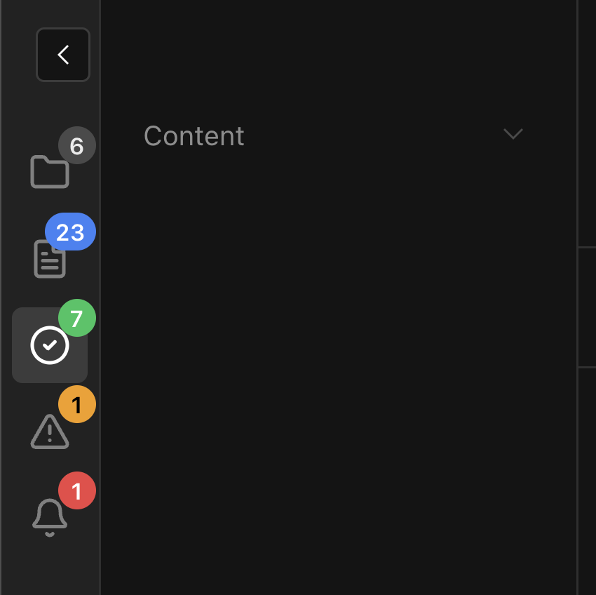

# Payload Enhanced Sidebar

An enhanced sidebar plugin for [Payload CMS](https://payloadcms.com) that adds a tabbed navigation system to organize collections and globals into logical groups.

> **Note:** This plugin is in early development and has not been extensively tested. Use with caution in production environments.

## Features

- **Tabbed Navigation** - Organize collections into separate tabs for cleaner navigation
- **Vertical Tab Bar** - Icon-based tabs on the left side of the sidebar
- **Link Support** - Add navigation links (like Dashboard) alongside tabs
- **Custom Items** - Add custom navigation items that can be merged into existing groups
- **Badges** - Show notification badges on tabs and navigation items (API-based or reactive provider)
- **Custom Components** - Replace any part of the sidebar with your own React components
- **i18n Support** - Full localization support for labels and groups
- **Lucide Icons** - Use any [Lucide icon](https://lucide.dev/icons) for tabs and links, or provide a custom icon component per tab



## Installation

```bash
npm install @veiag/payload-enhanced-sidebar
# or
yarn add @veiag/payload-enhanced-sidebar
# or
pnpm add @veiag/payload-enhanced-sidebar
```

## Quick Start

```typescript
import { payloadEnhancedSidebar } from '@veiag/payload-enhanced-sidebar'
import { buildConfig } from 'payload'

export default buildConfig({
  // ... your config
  plugins: [
    payloadEnhancedSidebar({
      // Works with defaults!
    }),
  ],
})
```

This will add:
- A Dashboard link at the top
- A default tab showing all collections and globals
- A logout button at the bottom



## Configuration

### Full Configuration Example

```typescript
import { payloadEnhancedSidebar } from '@veiag/payload-enhanced-sidebar'
import { buildConfig } from 'payload'

export default buildConfig({
  plugins: [
    payloadEnhancedSidebar({
      // Tabs and links in the sidebar
      tabs: [
        // Dashboard link
        {
          id: 'dashboard',
          type: 'link',
          href: '/',
          icon: 'House',
          label: { en: 'Dashboard', uk: 'Головна' },
        },
        // Content tab - shows specific collections
        {
          id: 'content',
          type: 'tab',
          icon: 'FileText',
          label: { en: 'Content', uk: 'Контент' },
          collections: ['posts', 'pages', 'categories'],
        },
        // Link to external documentation
        {
          id: 'docs',
          type: 'link',
          href: 'https://payloadcms.com/',
          icon: 'BookOpen',
          isExternal: true,
          label: { en: 'Documentation', uk: 'Документація' },
        },
        // E-commerce tab with custom items
        {
          id: 'ecommerce',
          type: 'tab',
          icon: 'ShoppingCart',
          label: { en: 'E-commerce', uk: 'E-commerce' },
          collections: ['products', 'orders', 'customers'],
          customItems: [
            {
              slug: 'analytics',
              href: '/analytics',
              label: { en: 'Analytics', uk: 'Аналітика' },
              group: 'E-commerce', // Merge into existing group
            },
          ],
        },
        // Settings tab with globals
        {
          id: 'settings',
          type: 'tab',
          icon: 'Settings',
          label: { en: 'Settings', uk: 'Налаштування' },
          collections: ['users'],
          globals: ['site-settings', 'footer-settings'],
          customItems: [
            {
              slug: 'api-keys',
              href: '/api-keys',
              label: { en: 'API Keys', uk: 'API Ключі' },
              // No group - will appear at the bottom
            },
            {
              slug:'external-link',
              href: 'https://example.com',
              isExternal: true,
              label: { en: 'External Link', uk: 'Зовнішнє Посилання'}
            }
          ],
        },
      ],

      // Show/hide logout button (default: true)
      showLogout: true,

      // Disable the plugin
      disabled: false,
    }),
  ],
})
```

## Configuration Options

### `tabs`

Array of tabs and links to show in the sidebar.

**Tab (`type: 'tab'`)**

| Property | Type | Required | Description |
|----------|------|----------|-------------|
| `id` | `string` | Yes | Unique identifier |
| `type` | `'tab'` | Yes | Tab type |
| `icon` | `IconName` | Yes* | Lucide icon name |
| `iconComponent` | `string` | Yes* | Path to a custom icon component |
| `label` | `LocalizedString` | Yes | Tab tooltip/label |
| `collections` | `CollectionSlug[]` | No | Collections to show in this tab |
| `globals` | `GlobalSlug[]` | No | Globals to show in this tab |
| `customItems` | `SidebarTabItem[]` | No | Custom navigation items |
| `badge` | `BadgeConfig` | No | Badge configuration for the tab icon |

> \* Exactly one of `icon` or `iconComponent` is required — they are mutually exclusive.

> If neither `collections` nor `globals` are specified, the tab shows all collections and globals.


**Link (`type: 'link'`)**

| Property | Type | Required | Description |
|----------|------|----------|-------------|
| `id` | `string` | Yes | Unique identifier |
| `type` | `'link'` | Yes | Link type |
| `icon` | `IconName` | Yes* | Lucide icon name |
| `iconComponent` | `string` | Yes* | Path to a custom icon component |
| `label` | `LocalizedString` | Yes | Link tooltip/label |
| `href` | `string` | Yes | URL |
| `isExternal` | `boolean` | No | If true, `href` is absolute URL, if not, `href` is relative to admin route |
| `badge` | `BadgeConfig` | No | Badge configuration for the link icon |

> \* Exactly one of `icon` or `iconComponent` is required — they are mutually exclusive.




### `customItems`

Custom items can be added to any tab:

```typescript
{
  slug: 'unique-slug',           // Required: unique identifier
  href: '/path',                 // Required: URL
  label: { en: 'Label' },        // Required: display label
  group: { en: 'Group Name' },   // Optional: merge into existing group or create new
  isExternal: true,              // Optional: if true, href is absolute URL
}
```

**Group behavior:**
- If `group` matches an existing collection group label, the item is added to that group
- If `group` doesn't match any existing group, a new group is created
- If `group` is not specified, the item appears at the bottom as ungrouped


## Badges

Badges allow you to show notification counts on tabs and navigation items. There are three ways to configure badges:

<!-- [screenshot - Badges showcase: show sidebar with multiple badges - on tab icon (red "5"), on nav item (blue "12"), maybe one with "99+". Show different colors: error (red), primary (blue), warning (yellow)] -->

### Badge on Tabs/Links

Add a `badge` property to any tab or link in the `tabs` array:

```typescript
tabs: [
  {
    id: 'orders',
    type: 'tab',
    icon: 'ShoppingCart',
    label: 'Orders',
    collections: ['orders'],
    // Badge on the tab icon
    badge: {
      type: 'collection-count',
      collectionSlug: 'orders',
      color: 'error',
    },
  },
]
```

### Badges on Navigation Items

Use the `badges` configuration to add badges to any sidebar item (collections, globals, or custom items):

```typescript
payloadEnhancedSidebar({
  badges: {
    // Show document count for posts collection
    posts: { type: 'collection-count', color: 'primary' },
    // Custom API endpoint
    orders: {
      type: 'api',
      endpoint: '/api/orders/pending',
      responseKey: 'count',
      color: 'error',
    },
    // Provider-based (reactive)
    notifications: { type: 'provider', color: 'warning' },
  },
})
```

### Badge Types

#### `collection-count`

Automatically fetches document count from a collection.

```typescript
{
  type: 'collection-count',
  collectionSlug?: string,  // Defaults to item's slug
  color?: BadgeColor,       // 'default' | 'primary' | 'success' | 'warning' | 'error'
  where?: object,           // Optional filter query
}
```

#### `api`

Fetches badge value from a custom API endpoint.

```typescript
{
  type: 'api',
  endpoint: string,         // API URL (relative or absolute)
  method?: 'GET' | 'POST',  // Default: 'GET'
  responseKey?: string,     // Key to extract from response. Default: 'count'
  color?: BadgeColor,
}
```

#### `provider`

Uses reactive values from `BadgeProvider` context. Values update automatically when the provider changes.

```typescript
{
  type: 'provider',
  slug?: string,            // Key in provider values. Defaults to item's slug/id
  color?: BadgeColor,
}
```

### Using BadgeProvider

For reactive badges (real-time updates, websockets, etc.), use the `BadgeProvider`:

1. Create a provider component:

```typescript
// components/MyBadgeProvider.tsx
'use client'

import { BadgeProvider } from '@veiag/payload-enhanced-sidebar'
import { useEffect, useState } from 'react'

export const MyBadgeProvider = ({ children }) => {
  const [counts, setCounts] = useState({
    orders: 0,
    notifications: 0,
  })

  useEffect(() => {
    // Fetch initial counts, subscribe to websocket, etc.
    const ws = new WebSocket('wss://your-api/counts')
    ws.onmessage = (e) => setCounts(JSON.parse(e.data))
    return () => ws.close()
  }, [])

  return <BadgeProvider values={counts}>{children}</BadgeProvider>
}
```

2. Add it to Payload's providers:

```typescript
// payload.config.ts
export default buildConfig({
  admin: {
    components: {
      providers: ['./components/MyBadgeProvider#MyBadgeProvider'],
    },
  },
})
```

3. Configure badges to use the provider:

```typescript
payloadEnhancedSidebar({
  badges: {
    orders: { type: 'provider', color: 'error' },
  },
  tabs: [
    {
      id: 'notifications',
      type: 'link',
      href: '/notifications',
      icon: 'Bell',
      label: 'Notifications',
      badge: { type: 'provider', slug: 'notifications', color: 'warning' },
    },
  ],
})
```

### Badge Colors

Available colors: `default`, `primary`, `success`, `warning`, `error`



### Badge Display

- Numbers up to 99 are shown as-is
- Numbers > 99 are shown as "99+"
- Zero or undefined values hide the badge
- Provider values can also be React nodes for custom rendering

### `showLogout`

Show/hide the logout button at the bottom of the tabs bar.

- **Type:** `boolean`
- **Default:** `true`

### `disabled`

Completely disable the plugin.

- **Type:** `boolean`
- **Default:** `false`

## Custom Components

You can replace any part of the sidebar with your own React components. The plugin registers them automatically in Payload's import map — no manual import map configuration needed.

```typescript
payloadEnhancedSidebar({
  customComponents: {
    // Replace individual nav items (collections, globals, custom links)
    NavItem: './components/Sidebar#MyNavItem',
    // Replace group headers
    NavGroup: './components/Sidebar#MyNavGroup',
    // Replace the entire nav scroll area
    NavContent: './components/Sidebar#MyNavContent',
    // Replace every button in the tabs bar (tabs and links)
    TabButton: './components/Sidebar#MyTabButton',
  },
  tabs: [
    {
      id: 'dashboard',
      type: 'link',
      href: '/',
      // Custom icon for just this tab/link (mutually exclusive with `icon`)
      iconComponent: './components/Sidebar#DashboardIcon',
      label: 'Dashboard',
    },
  ],
})
```

All custom components are client components (`'use client'`). The plugin provides hooks to connect them to sidebar state:

| Hook | Description |
|------|-------------|
| `useNavItemState(href)` | `{ isActive, isCurrentPage }` — for custom NavItem |
| `useTabState(id)` | `{ isActive }` — for custom NavContent or TabButton |
| `useEnhancedSidebar()` | `{ activeTabId, onTabChange }` — full tab context |

**→ See [docs/custom-components.md](docs/custom-components.md) for full documentation, prop types, and examples for each slot.**

## Localization

All labels support localized strings:

```typescript
label: 'Simple string'
// or
label: {
  en: 'English',
  uk: 'Українська',
  de: 'Deutsch',
}
```

## Payload Features Support

- **Browse by Folder Button** - Automatically shows folder view button when Payload folders are enabled (requires Payload v3.41.0+)
- **Settings Menu Items** - Integrates with Payload's SettingsMenu components (requires Payload v3.60.0+)

## Contributing

Contributions are welcome! Please feel free to submit a Pull Request.

1. Fork the repository
2. Create your feature branch (`git checkout -b feature/amazing-feature`)
3. Commit your changes (`git commit -m 'Add some amazing feature'`)
4. Push to the branch (`git push origin feature/amazing-feature`)
5. Open a Pull Request

## Issues

Found a bug or have a feature request? Please open an issue on [GitHub](https://github.com/VeiaG/payload-enhanced-sidebar/issues).

## License

MIT © [VeiaG](https://github.com/VeiaG)

## Links

- [GitHub Repository](https://github.com/VeiaG/payload-enhanced-sidebar)
- [Payload CMS](https://payloadcms.com)
- [Lucide Icons](https://lucide.dev/icons)

---

### More plugins and Payload resources at [PayloadCMS Extensions](https://payload.veiag.dev/)
